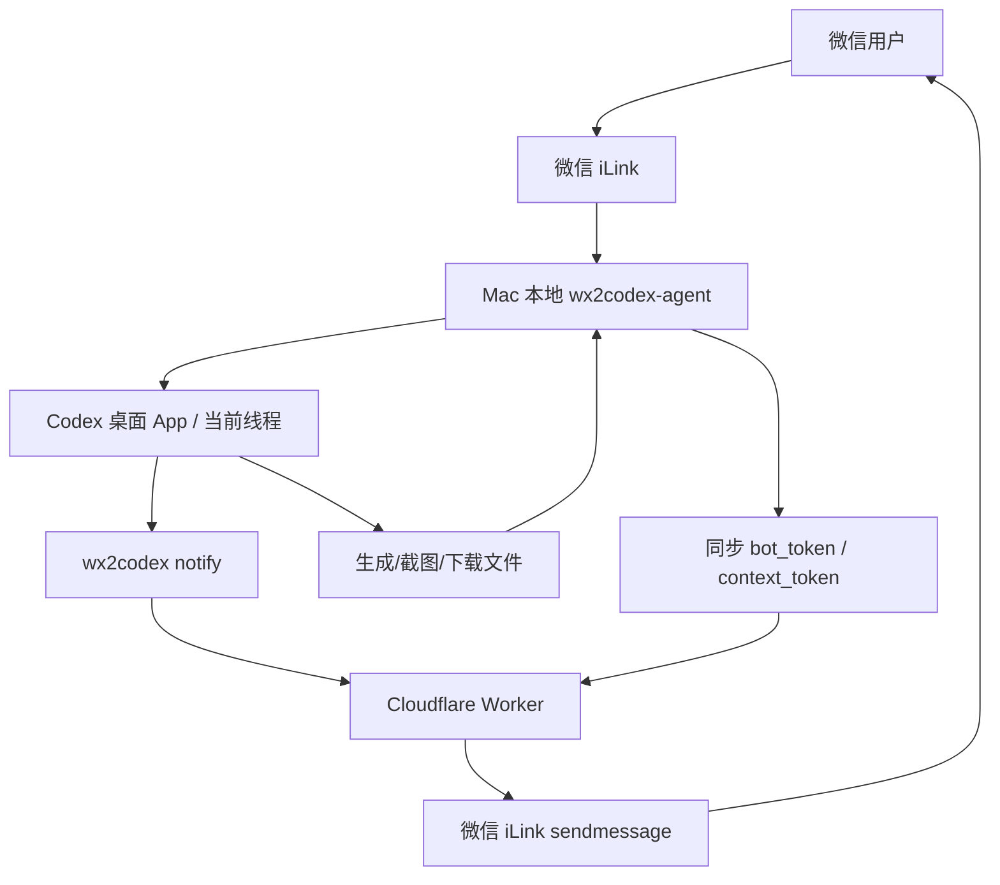

# wx2codex

wx2codex 是一个轻量的 macOS 本地 Agent + Cloudflare 云端服务，用来实现：

- 微信消息 → 本地 Agent → 现有 Codex 桌面 App → 指定 Codex 线程；
- Codex 任务完成 → 本地 Agent 请求云端 → 云端通过微信 iLink 发通知到微信；
- 微信图片/文件附件 → 本地 Agent 下载解密保存 → 图片以 `localImage` 形式交给 Codex，文件以本地路径交给 Codex 读取分析；
- 截屏、搜图、网页、表格、文档等任务全部由 Codex 桌面 App 执行，wx2codex 只负责传递消息和文件；
- 不做传统账号密码，用户身份使用微信 iLink 返回的 `ilink_user_id`；
- 云端只做登录识别、设备鉴权、会员有效期管控、token 加密保存、24 小时会话窗口校验和低频通知代发。

## 架构



关键凭据模型：

```text
ilink_user_id  = 用户身份标识，不是秘密
bot_token      = iLink 长期访问凭证，需要本地和云端加密保存
context_token  = 会话回复凭证，按 24 小时窗口处理，收到微信消息就刷新
to_user_id     = iLink 内的微信会话用户 ID，通常稳定
agent_token    = wx2codex 云端签发给本机 Agent 的鉴权 token
```

## 目录

```text
cloud/                 Cloudflare Worker 云服务
cloud/migrations/      D1 数据库 schema
wx2codex_agent/        macOS 本地 Python Agent/CLI
scripts/install.sh     本地安装脚本
scripts/deploy-cloud.sh 云端部署脚本
```

## 一条命令安装（普通用户）

普通用户只需要在 macOS 终端运行这一条命令：

```bash
curl -fsSL https://codex.292828.xyz/install.sh | bash
```

这条命令会自动完成：

1. 下载 wx2codex Agent；
2. 创建 `~/.wx2codex/venv` 虚拟环境；
3. 安装 `wx2codex` 命令；
4. 自动配置云端地址 `https://codex.292828.xyz`；
5. 显示微信 iLink 二维码，用户扫码确认；
6. 注册云端用户和设备；
7. 安装 macOS LaunchAgent，让 Agent 后台常驻。

如果只想安装不扫码：

```bash
curl -fsSL https://codex.292828.xyz/install.sh | WX2CODEX_SKIP_CONNECT=1 bash
```

安装后常用命令：

```bash
~/.wx2codex/venv/bin/wx2codex status
~/.wx2codex/venv/bin/wx2codex connect
~/.wx2codex/venv/bin/wx2codex install-service
~/.wx2codex/venv/bin/wx2codex codex doctor
~/.wx2codex/venv/bin/wx2codex codex threads
```

如果 `~/.local/bin` 在 PATH 中，也可以直接用：

```bash
wx2codex status
```


## 用户指导说明书

### 最简单的使用方式

普通用户只需要复制下面这一条命令到 macOS 终端执行：

```bash
curl -fsSL https://codex.292828.xyz/install.sh | bash
```

安装脚本会自动下载 Agent、安装命令、配置云端、引导微信扫码，并安装后台服务。

### 安装命令开关

#### 只安装，不立刻扫码

```bash
curl -fsSL https://codex.292828.xyz/install.sh | WX2CODEX_SKIP_CONNECT=1 bash
```

后面想连接微信时再执行：

```bash
wx2codex connect
wx2codex install-service
```

#### 指定安装目录

默认安装到 `~/.wx2codex`。如果想换目录：

```bash
curl -fsSL https://codex.292828.xyz/install.sh | WX2CODEX_HOME="$HOME/.wx2codex-test" bash
```

#### 指定命令软链接目录

默认把 `wx2codex` 链接到 `~/.local/bin/wx2codex`。如果想换目录：

```bash
curl -fsSL https://codex.292828.xyz/install.sh | WX2CODEX_BIN_DIR="$HOME/bin" bash
```

#### 指定云端地址

一般不需要改，默认就是 `https://codex.292828.xyz`。如果以后有测试环境，可以这样指定：

```bash
curl -fsSL https://codex.292828.xyz/install.sh | WX2CODEX_CLOUD_URL="https://codex.292828.xyz" bash
```

#### 多个开关一起用

```bash
curl -fsSL https://codex.292828.xyz/install.sh | WX2CODEX_SKIP_CONNECT=1 WX2CODEX_HOME="$HOME/.wx2codex-test" bash
```

### 安装后的常用命令

如果 `wx2codex` 不在 PATH 里，可以用完整路径：

```bash
~/.wx2codex/venv/bin/wx2codex
```

#### 查看状态

```bash
wx2codex status
```

输出 JSON：

```bash
wx2codex status --json
```

#### 配置云端或 Codex 连接方式

```bash
wx2codex configure --cloud-url https://codex.292828.xyz
wx2codex configure --codex-provider desktop
wx2codex configure --cwd /path/to/project
wx2codex configure --codex-binary "$(command -v codex)"
wx2codex configure --heartbeat-interval-seconds 3600
```

默认使用 `desktop`：连接已经打开的 Codex 桌面 App，不再由后台 LaunchAgent 另起一套 Codex CLI app-server。这样截图、浏览器、文件编辑等任务会在桌面 Codex 的权限环境里执行。`app_server` 只作为旧方案/调试方案，`ui` 只作为 UI 自动化回退方案。

云端 heartbeat 默认 3600 秒（1 小时）一次，只用于更新后台设备在线时间 `last_seen_at`，不影响微信消息收发。

#### 微信扫码连接

```bash
wx2codex connect
```

只保存本地，不注册云端：

```bash
wx2codex connect --no-cloud
```

设置扫码等待时间，例如等待 180 秒：

```bash
wx2codex connect --timeout 180
```

#### 启动监听

前台持续监听微信消息并输入 Codex：

```bash
wx2codex run
```

只拉取一次消息后退出，适合调试：

```bash
wx2codex run --once
```

只监听和同步云端，不输入 Codex：

```bash
wx2codex run --no-codex
```

组合调试：

```bash
wx2codex run --once --no-codex
```

#### Codex 线程和项目目录

检查本机 Codex 桌面连接是否可用：

```bash
wx2codex codex doctor
```

列出最近线程：

```bash
wx2codex codex threads
```

查看当前线程：

```bash
wx2codex codex thread
```

切换线程：

```bash
wx2codex codex use 1
wx2codex codex use <thread_id>
```

切换为跟随 Codex 桌面当前线程：

```bash
wx2codex codex new
```

注意：默认 `desktop` 模式不会在后台偷偷新建并提交线程。请先在 Codex 桌面 App 里打开/新建线程，再用 `wx2codex codex threads` 和 `wx2codex codex use` 选择；`wx2codex codex new "任务"` 只适合旧 `app_server` 调试模式。

设置默认项目目录：

```bash
wx2codex codex cwd /path/to/project
```

查看最近项目：

```bash
wx2codex codex projects
```

#### 安装或卸载后台服务

安装后台常驻服务：

```bash
wx2codex install-service
```

后台只同步，不输入 Codex：

```bash
wx2codex install-service --no-codex
```

卸载后台服务：

```bash
wx2codex uninstall-service
```

完整卸载本机 wx2codex（后台服务、命令软链、`~/.wx2codex` 本地数据/虚拟环境）：

```bash
wx2codex uninstall --dry-run
wx2codex uninstall --yes
```

如果只想移除后台服务和命令软链、保留本地配置和 token：

```bash
wx2codex uninstall --yes --keep-data
```

日志位置：

```text
~/.wx2codex/logs/agent.out.log
~/.wx2codex/logs/agent.err.log
```

#### 发送微信通知

```bash
wx2codex notify "Codex 任务已完成"
```

不加默认前缀：

```bash
wx2codex notify "任务完成" --no-prefix
```

指定某个微信用户：

```bash
wx2codex notify "任务完成" --to-user-id "xxx@im.wechat"
```

### 卸载

```bash
wx2codex uninstall --yes
```

### 使用注意

- 默认使用 Codex 桌面 App，请先打开并登录 Codex；
- 普通微信文本会尽量原样进入 Codex 桌面线程，不再追加大段“通道规则”；只有截图/图片等可能需要回传本地图片的任务，才会追加一行极简 `WX2CODEX_SEND_FILE` 提示；
- 收到会进入 Codex 的普通微信消息后，Agent 会先发送微信“对方正在输入...”状态，并在 Codex 长任务期间定时刷新；
- 可以直接在微信里说“发一张某某图片/照片”，任务会交给 Codex 执行；
- 可以直接给微信发送图片或文件并附带说明，Agent 会下载附件后交给 Codex 分析；附件默认保存到当前项目 `.wx2codex_attachments/`；
- 可以直接在微信里说“截屏给我”，任务会交给 Codex 桌面执行；如果 Codex 需要把本地图片发回微信，建议先保存/复制到 `~/.wx2codex/outbox/`，再在最终回复里输出 `WX2CODEX_SEND_FILE: ~/.wx2codex/outbox/image.png`；
- 如果手动切到 `--codex-provider ui` 回退方案，首次自动输入 Codex 时 macOS 可能要求给 Terminal / Python / Codex 辅助功能权限；
- 微信通知受 24 小时会话窗口限制，超过 24 小时需要用户先在微信里主动发一条消息；
- 如果终端提示 `wx2codex: command not found`，请使用完整路径 `~/.wx2codex/venv/bin/wx2codex`，或者把 `~/.local/bin` 加入 PATH。

### 微信里可直接发送的命令

```text
/threads                 列出最近 Codex 线程
/threads all             列出全部最近线程
/thread                  查看当前线程
/use 1                   切换到线程列表第 1 个
/use <thread_id>         切换到指定线程
/new                     desktop 模式下跟随 Codex 桌面当前线程
/new 任务说明             app_server 旧模式下新建线程并发送第一条任务
/cwd                     查看当前项目目录
/cwd /path/to/project    切换项目目录
/projects                查看最近项目目录
/status                  查看连接状态
/help                    查看帮助
```

不以 `/` 开头的普通微信消息，会发送到当前 Codex 桌面线程；如果还没有当前线程，请先在 Codex 桌面打开一个线程，或在微信里用 `/use <thread_id>` 选择线程。

## 本地源码安装（开发者）

```bash
cd /path/to/wx2codex
./scripts/install.sh
```

## 云端部署到 Cloudflare

需要 Cloudflare API Token 具备：

- Account / Workers Scripts / Edit
- Account / D1 / Edit
- 如果要自动绑定 `codex.292828.xyz`，还需要 Workers Custom Domains / DNS / Workers Routes 相关权限

部署：

```bash
export CLOUDFLARE_API_TOKEN="你的 Cloudflare Token"
./scripts/deploy-cloud.sh
```

部署成功后会输出 `https://codex.292828.xyz` 和/或 workers.dev 地址。若自定义域名权限不足，可以先使用 workers.dev 地址：

```bash
wx2codex configure --cloud-url https://wx2codex-cloud.<你的 workers 子域>.workers.dev
```

`cloud/wrangler.toml` 已默认配置：

```toml
routes = [
  { pattern = "codex.292828.xyz", custom_domain = true }
]
```

如果 Token 权限不足，部署脚本仍可先发布 workers.dev；之后可以在 Cloudflare 控制台手动给 `wx2codex-cloud` 添加 Custom Domain。


## 管理后台

部署后可以直接在浏览器打开：

```text
https://codex.292828.xyz
```

Worker 会自动跳转到 `/admin`。后台提供：

- 总览统计：用户数、设备数、有效会员、过期会员、试用用户、付费/手动开通用户、订单数；
- 会员管理：搜索用户、查看 `ilink_user_id`、会员到期时间、剩余天数、设备/会话/通知数据；
- 手动开通/续费：给用户加 7/30/365 天，或直接设置套餐、状态、到期时间；
- 数据表查看：`users`、`memberships`、`orders`、`devices`、`ilink_credentials`、`ilink_contexts`、`notify_logs`；
- 敏感字段只展示 hash/摘要，不在页面直接展示明文 `bot_token` 或 `context_token`。

管理员登录由 Cloudflare Secrets 控制：

```bash
printf '%s' 'admin' | npx wrangler secret put ADMIN_USERNAME
printf '%s' '<sha256(password)>' | npx wrangler secret put ADMIN_PASSWORD_SHA256
printf '%s' '<random-session-secret>' | npx wrangler secret put ADMIN_SESSION_SECRET
```

### 会员与收费

- 新用户第一次扫码注册时，云端会自动创建 `memberships` 记录，默认赠送 7 天试用；
- 试用/会员过期后，本地 Agent 只负责把最新 `context_token` 同步给云端并拦截消息，不再转给 Codex，也不在用户电脑上生成/发送支付二维码或链接；
- 支付通知由云端创建 5 分钟有效的微信支付 Native 订单后发送到用户微信：文字里发送我们的支付页面链接，二维码放在网页里，用户打开网页后长按/识别二维码完成支付；
- 当前定价写在云端配置里：`ANNUAL_PRICE_CENTS = 990`，即 9.9 元 / 年；
- 后台的“续 365 天”会写入一条 `orders` 记录，`provider = manual_admin`，适合先做人工收款/内测；
- 当前自动收费走**微信支付商户号 Native 支付**：创建订单后返回支付二维码页面，支付回调成功后由云端查询微信支付订单并自动把会员延长 365 天。

微信支付配置：

```bash
printf '%s' '<apiclient_key.pem 内容>' | npx wrangler secret put WECHAT_PAY_PRIVATE_KEY_PEM
printf '%s' '<32 位 APIv3 密钥>' | npx wrangler secret put WECHAT_PAY_API_V3_KEY
```

`cloud/wrangler.toml` 中配置：

```toml
WECHAT_PAY_APP_ID = "小程序 AppID"
WECHAT_PAY_MCH_ID = "微信支付商户号"
WECHAT_PAY_MERCHANT_SERIAL_NO = "商户 API 证书序列号"
WECHAT_PAY_NOTIFY_URL = "https://codex.292828.xyz/v1/pay/wechat/notify"
PAYMENT_EXPIRE_MINUTES = "5"
```

数据库迁移：

```bash
cd cloud
npm run migrate:remote
npm run migrate:membership:remote
```

## 使用流程

### 1. 配置云端

```bash
wx2codex configure --cloud-url https://codex.292828.xyz
wx2codex configure --codex-provider desktop
wx2codex codex cwd /path/to/project
```

或者使用部署输出的 workers.dev 地址。

### 2. 微信扫码连接

```bash
wx2codex connect
```

这一步会：

1. 从微信 iLink 获取二维码；
2. 用户微信扫码并确认；
3. 本地保存 `bot_token`；
4. 云端用 `ilink_user_id` 识别/创建用户；
5. 云端加密保存 `bot_token`；
6. 云端签发 `agent_token` 给本地 Agent。

### 3. 启动监听

```bash
wx2codex run
```

收到微信消息后，Agent 会：

1. 从 `getupdates` 获取消息；
2. 保存并同步 `to_user_id + context_token`；
3. 如果消息是 `/threads`、`/use`、`/cwd` 等命令，就在本地处理并回复微信；
4. 如果消息里带微信图片/文件，Agent 会先下载解密到当前项目的 `.wx2codex_attachments/`，图片会作为 `localImage` 一起提交给 Codex，文件会把绝对路径交给 Codex 读取；
5. 其他普通文本通过 Codex 桌面 IPC 发送到当前线程；
6. Codex 完成后，直接把结果正文回复到微信；长回复会自动拆成多条微信消息发送。

设计原则：**wx2codex 只做消息/附件传递，不替 Codex 执行用户任务**。

- “截屏给我”“搜索一张图片”“制作网页/表格/文档”等任务都交给 Codex 执行；
- wx2codex 不再本地调用 `screencapture`，也不再本地搜图；
- 如果 Codex 已经生成、截取或下载了需要发回微信的本地图片，可以在最终回复中单独输出：

```text
WX2CODEX_SEND_FILE: ~/.wx2codex/outbox/image.png
```

wx2codex 会把这张本地图片原样转发到微信。这个步骤只负责传递文件，不负责生成、截图、搜索或编辑。为避免 macOS 后台进程读取 Desktop/Documents 路径被 TCC 拦截，推荐把要回传的文件放到 `~/.wx2codex/outbox/`。

只有手动回退到 UI 自动化 provider 时，macOS 才可能要求给 Terminal / Python / Codex 辅助功能权限。

### 4. 发送任务完成通知

```bash
wx2codex notify "Codex 任务已完成：已经修复并测试通过。"
```

云端会检查：

```text
agent_token 有效
bot_token 有效
context_token 未超过 24 小时窗口
```

然后调用微信 iLink `sendmessage`。

### 5. 后台运行

```bash
wx2codex install-service
```

日志位置：

```text
~/.wx2codex/logs/agent.out.log
~/.wx2codex/logs/agent.err.log
```

卸载：

```bash
wx2codex uninstall-service
```

## 常用命令

```bash
wx2codex status
wx2codex connect
wx2codex run --once --no-codex
wx2codex notify "测试消息"
wx2codex codex doctor
wx2codex codex threads
wx2codex codex cwd /path/to/project
```

## 安全说明

- `bot_token` 和 `context_token` 在云端用 `WX2CODEX_CIPHER_KEY` 加密后存入 D1；
- `agent_token` 只保存哈希；
- `ilink_user_id` 只用于识别用户身份，不能当作鉴权凭证；
- `context_token` 按 24 小时会话窗口处理，过期后需要微信用户主动再发一条消息刷新。

## 当前限制

- 默认使用 Codex 桌面 IPC；AppleScript UI 自动化仅作为手动回退方案；
- 暂时只支持 macOS；
- 自定义域名部署取决于 Cloudflare Token 权限；
- iLink 接口不是公开稳定 API，需持续关注兼容性。
